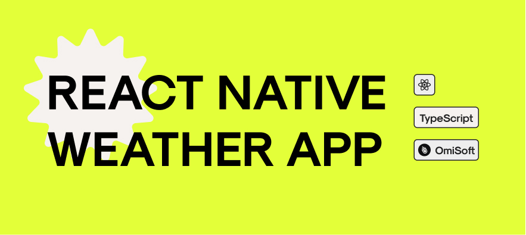
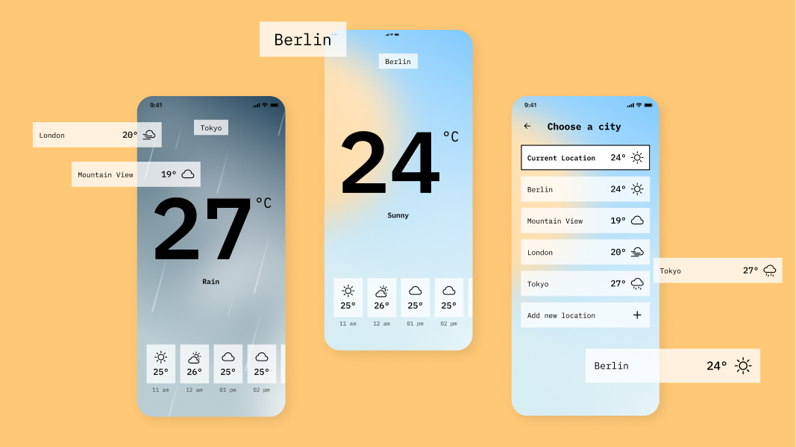

# WEATHER REACT NATIVE EXAMPLE

Here you can find a simple boilerplate for a React Native app. In this simple exercise you can see some core design patterns and best practices for React Native application that can be used everyday coding.

### Please Note

This react project uses the Expo CLI tools - we will be testing via these tools. For Reference:

- [Setting up a Dev Environment with Expo](https://reactnative.dev/docs/environment-setup)

## Instructions

Using the boilerplate provided you are asked to extend this app with the following tasks. Please commit work in a **NEW REPO** please use following naming convention: RNTA-(your name)-(date of completion).

1. Create a component which will display a friendly welcome message and image on "TabOne" screen
2. Create a service which allows access to a weather api (your choice) - [Api List](https://rapidapi.com/collection/list-of-free-apis)
3. There are some minor bugs, please find the existing layout issues and fix them
4. Please add a simple splashscreen and logo based on the this icon -> "WiDayCloudyGusts" which can be found on [React Icons](https://react-icons.github.io/react-icons)
5. Optional - you can use [React Native Elements](https://reactnativeelements.com/docs/icon) if you like ;)
6. Optional - there is a blank modal screen & if you want you can add some appropriate information to it.

We suspect this exercise should take no more than a working day (8 hours) to complete. And look forward to seeing what you come up with.

## Preview

## Created by
[OmiSoft](https://omisoft.net/?utm_source=github&utm_medium=social)

[![alt text][1.1]][1]
[![alt text][2.1]][2]

[1]: http://www.twitter.com/omisoftnet
[2]: http://www.facebook.com/omisoftnet

[1.1]: http://i.imgur.com/wWzX9uB.png (OmiSoft.net Twitter page)
[2.1]: http://i.imgur.com/fep1WsG.png (OmiSoft.net Facebook page)

## License
WEATHER REACT NATIVE EXAMPLE is released under the MIT license.  
See the [LICENSE](./LICENSE.md) for details.
